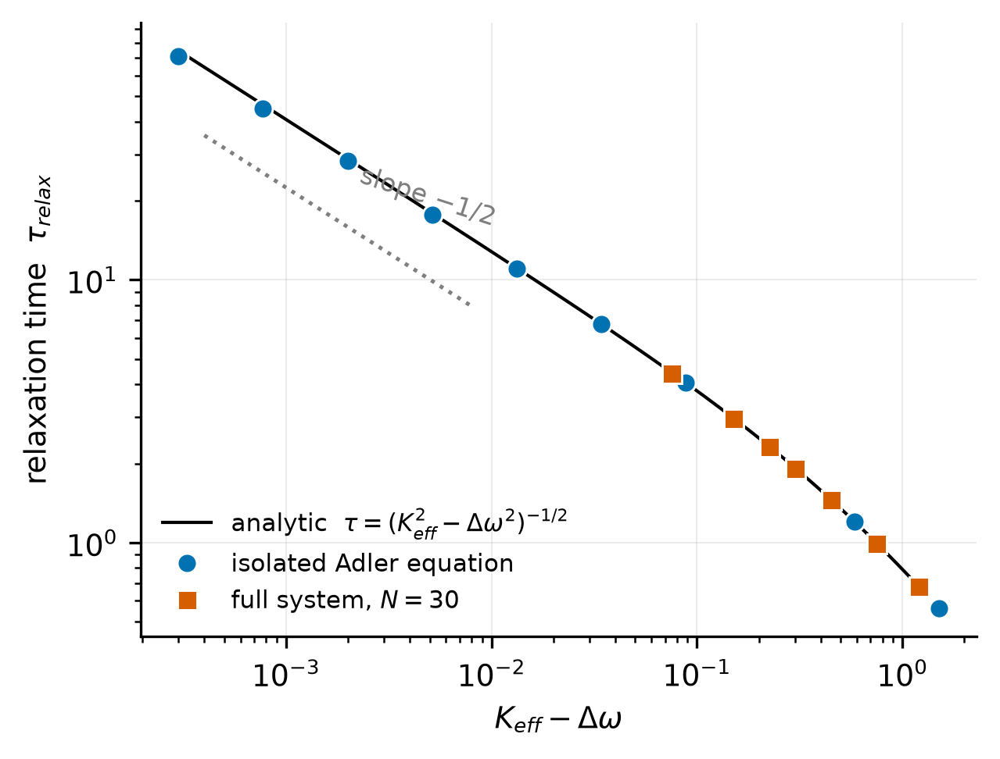

# Ghost Sensitivity Peaks in Adaptive Phase-Coupled Systems

**A disguised Adler bifurcation, found while calibrating a coupling floor — with the full verification record, including two rejected explanations and an independent reimplementation.**

Mihai Roșca · Independent researcher, Brăila, Romania · 2026

[](https://doi.org/10.5281/zenodo.21269201)

---

## The story in five lines

1. While calibrating a coupling floor `β_min` in an adaptively coupled Kuramoto system (N internal oscillators following a noisy human-intent estimate), sensitivity to genuine intent changes showed an unexpected **non-monotonic peak** at `β_min ≈ 0.15`, consistent across 7 noise levels.
2. Two plausible explanations — forced harmonic resonance and critical damping of the feedback loop — were **tested directly and rejected**; one arrived with an algebraically fabricated data column, caught by measurement.
3. The real mechanism is a **saddle-node-on-invariant-circle (SNIC) phase-locking bifurcation of Adler type**: near the locking threshold, critical slowing down makes fixed-window measurements register their deepest dips — a *ghost peak* that tracks the observation protocol, not the dynamics.
4. The scaling law `τ_relax = (K_eff² − Δω²)^(−1/2)` is confirmed on the isolated Adler equation (measured exponents **−0.5009** and **−0.4957** in two independent implementations) and on the full 30-oscillator system (**measured/predicted ratios 0.985–0.999**).
5. Everything here was **reproduced by an independent reimplementation** (different code, integrator, RNG, and seeds), yielding a derived calibration rule: `β_min ≥ m·Δω_max/K_ext` with `m(τ_target) = √(1 + (Δω_max·τ_target)⁻²)`.



## Repository layout

| Path | Contents |
|---|---|
| [`manuscript/`](manuscript/) | Preprint draft v0.1 (Markdown) + `make_figures.py` + all figures (PNG/PDF) |
| [`original/`](original/) | The original calibration script (`calibration_real.py`), its archived output, and the metric specification note |
| [`repro/`](repro/) | Independent reimplementation: `reproduce_p6.py` (claims A–D), `cross_validation_25_6.py` (ghost peak with different seeds/RNG), and the reproduction report |
| [`docs/`](docs/) | Working documents (Romanian): the original standalone result note and the gap analysis that drove this repo |

## Reproduce everything

```bash
pip install numpy matplotlib
python repro/reproduce_p6.py            # claims A-D: degenerate formula, exponent -0.5, T_slip, full-system tau, lock threshold
python repro/cross_validation_25_6.py   # the ghost peak, independent implementation, seeds 10-12
python original/calibration_real.py     # the original grid (seeds 1-3); reproduces original/output_original_confirmat.txt bit-for-bit
python manuscript/make_figures.py       # regenerates all four figures + margin-rule verification
```

Verified under Python 3.14 / NumPy 2.5 on Windows. No other dependencies.

## Key verified numbers

| Claim | Predicted | Measured (original) | Measured (independent reimpl.) |
|---|---|---|---|
| τ divergence exponent | −0.5 | −0.5009 | −0.4957 |
| T_slip ratio (4 values of K/Δω) | 1 | — | 1.0000 |
| Full-system τ ratio, 5 values of β | 1 | 0.9847–0.9965 | 0.9968–0.9990 |
| Ghost peak location | between the two Adler thresholds | β_min = 0.15 (all 7 noise levels) | β_min = 0.15 (all 7 noise levels) |

## AI-assisted research disclosure

This work was developed in iterative sessions with multiple AI systems used as drafting, critique, and verification instruments, with **executed code as the arbiter for every quantitative claim**. Two AI-proposed explanations were rejected by direct testing; one AI-supplied table was identified as containing fabricated values. The independent reimplementation was written by an AI system (Claude, Anthropic) from the equations alone, without access to the original code, and cross-validated against it. Full record: [`repro/RAPORT_REPRODUCERE.md`](repro/RAPORT_REPRODUCERE.md) and Appendix A of the manuscript.

## Citation

See [`CITATION.cff`](CITATION.cff). Archived release: [doi.org/10.5281/zenodo.21269201](https://doi.org/10.5281/zenodo.21269201).

## License

- **Code** (`*.py`): [MIT](LICENSE)
- **Manuscript, figures, and documentation**: [CC BY 4.0](https://creativecommons.org/licenses/by/4.0/)
